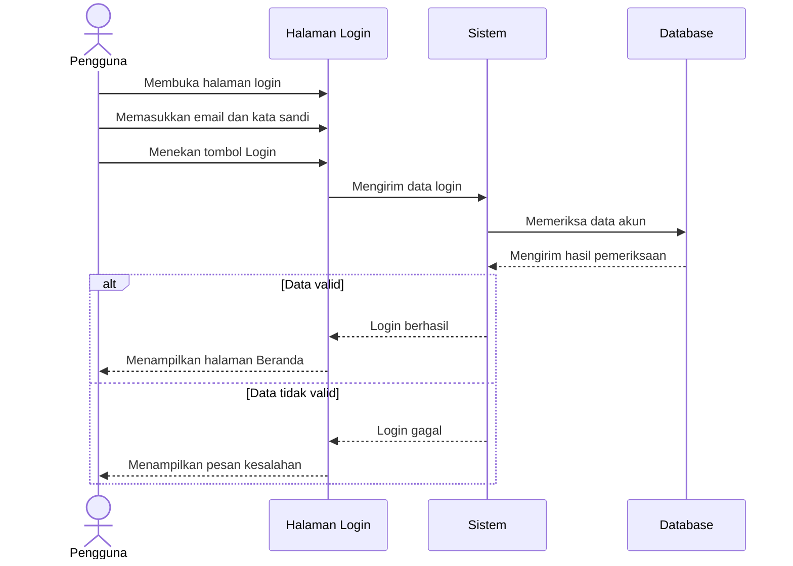
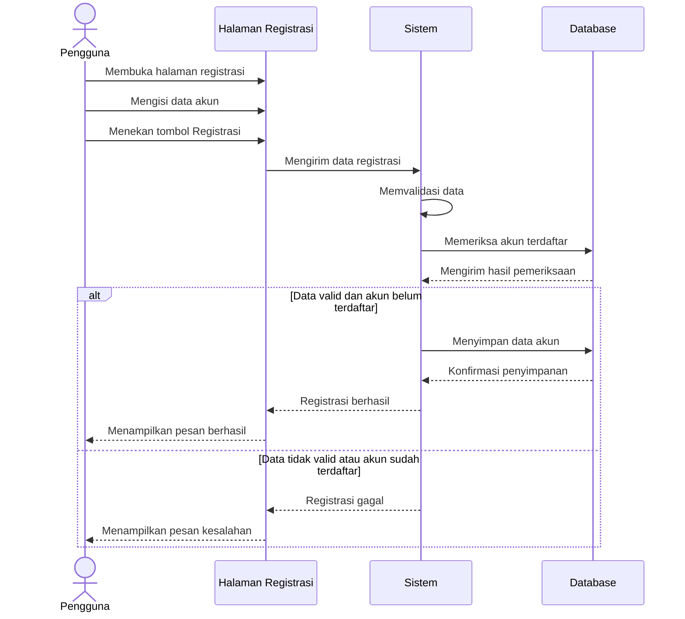
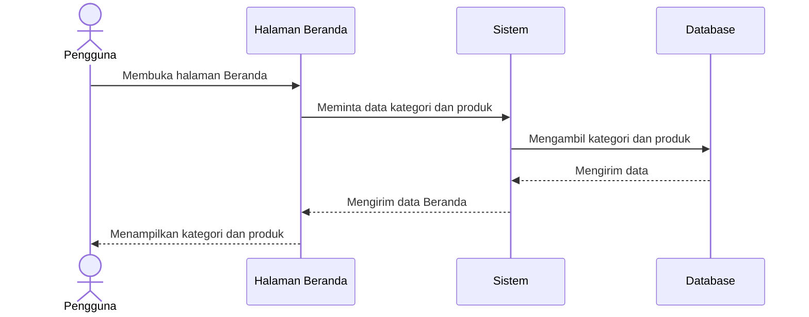
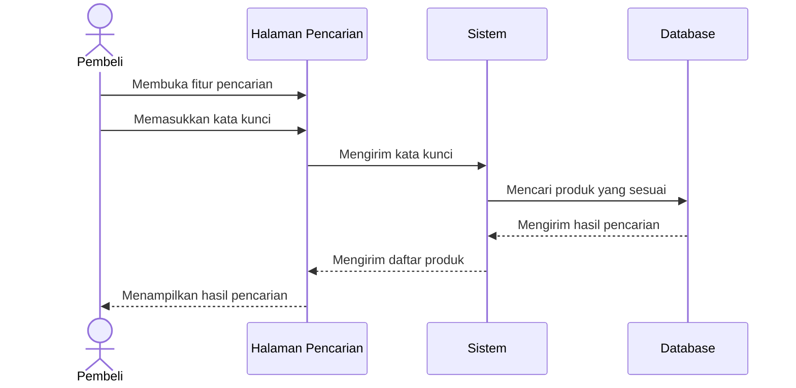
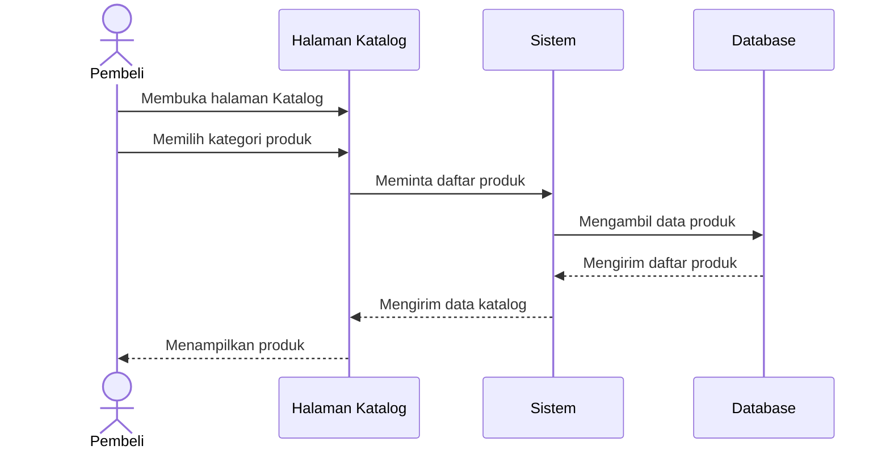
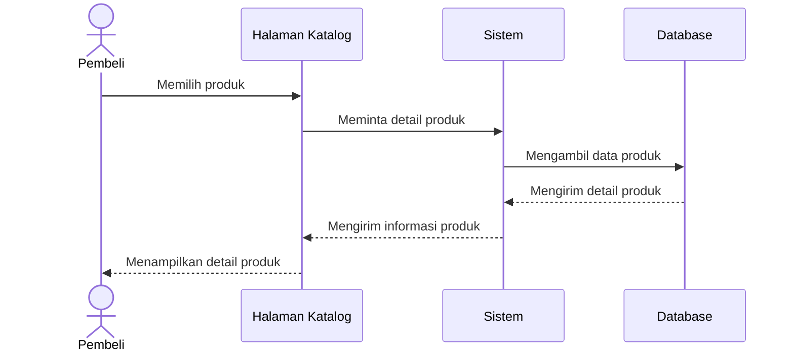
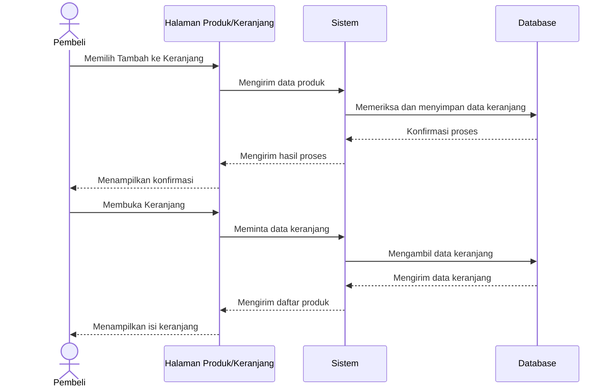
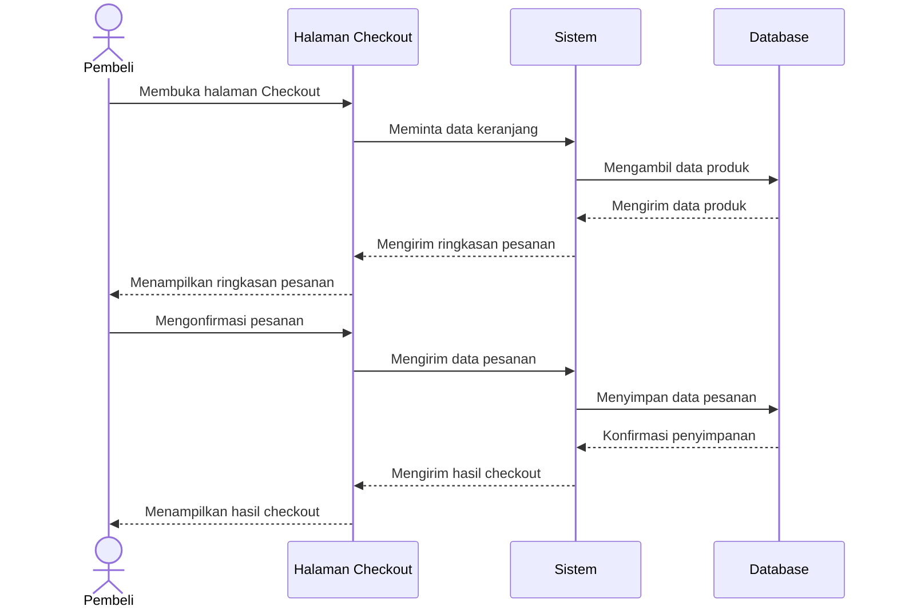
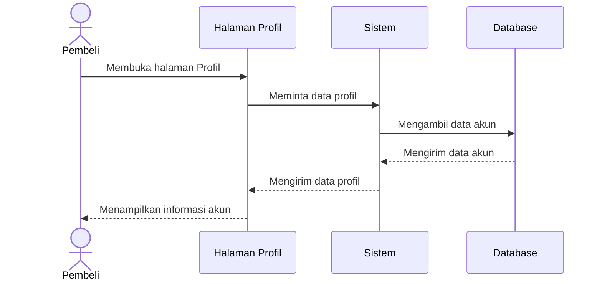
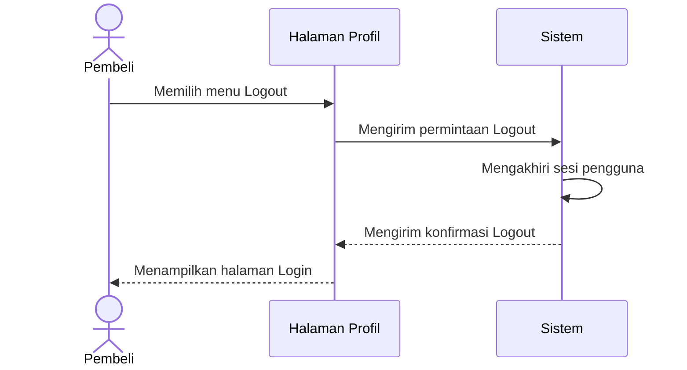

# PENJELASAN SEQUENCE DIAGRAM
## ClosetGirls ThriftShop

## 1. Pendahuluan

Sequence Diagram merupakan diagram yang digunakan untuk menggambarkan urutan interaksi antara pengguna, halaman sistem, proses sistem, dan database dalam menjalankan suatu fitur.

Pada proyek ClosetGirls ThriftShop, Sequence Diagram digunakan untuk menjelaskan alur kerja fitur-fitur utama sistem penjualan pakaian thrift, mulai dari login hingga pengguna keluar dari akun.

## 2. Tujuan Sequence Diagram

Tujuan pembuatan Sequence Diagram pada proyek ClosetGirls ThriftShop adalah:

1. Menggambarkan urutan interaksi antara pengguna dan sistem.
2. Menjelaskan proses yang terjadi pada setiap fitur.
3. Mempermudah anggota kelompok memahami alur kerja sistem sebelum tahap pengkodean.
4. Menjadi acuan dalam proses pengembangan dan pengujian sistem.

## 3. Sequence Diagram Login

### Pengertian

Sequence Diagram Login menggambarkan proses ketika pengguna memasukkan email dan kata sandi untuk masuk ke dalam sistem ClosetGirls ThriftShop.

### Diagram

### Penjelasan Proses

1. Pengguna membuka halaman Login.
2. Pengguna memasukkan email dan kata sandi.
3. Pengguna menekan tombol Login.
4. Sistem memeriksa data akun melalui database.
5. Jika data valid, pengguna diarahkan ke halaman Beranda.
6. Jika data tidak valid, sistem menampilkan pesan kesalahan.

## 4. Sequence Diagram Registrasi

### Pengertian

Sequence Diagram Registrasi menggambarkan proses pembuatan akun baru oleh pengguna agar dapat menggunakan sistem ClosetGirls ThriftShop.

### Diagram

### Penjelasan Proses

1. Pengguna membuka halaman Registrasi.
2. Pengguna mengisi data sesuai kolom yang tersedia.
3. Sistem memvalidasi data dan memeriksa apakah akun sudah terdaftar.
4. Jika data valid, sistem menyimpan akun ke database.
5. Sistem menampilkan hasil registrasi kepada pengguna.

## 5. Sequence Diagram Beranda

### Pengertian

Sequence Diagram Beranda menggambarkan proses ketika pengguna membuka halaman utama ClosetGirls ThriftShop untuk melihat kategori dan produk yang tersedia.

### Diagram

### Penjelasan Proses

1. Pengguna membuka halaman Beranda.
2. Sistem meminta data kategori dan produk dari database.
3. Database mengirimkan data yang tersedia.
4. Sistem mengirimkan data ke halaman Beranda.
5. Halaman Beranda menampilkan kategori dan produk kepada pengguna.

## 6. Sequence Diagram Pencarian Produk

### Pengertian

Sequence Diagram Pencarian Produk menggambarkan proses ketika pengguna mencari produk thrift berdasarkan kata kunci tertentu.

### Diagram

### Penjelasan Proses

1. Pembeli membuka fitur pencarian produk.
2. Pembeli memasukkan kata kunci produk.
3. Sistem mencari produk yang sesuai melalui database.
4. Database mengirimkan hasil pencarian.
5. Sistem menampilkan daftar produk kepada pembeli.

## 7. Sequence Diagram Katalog

### Pengertian

Sequence Diagram Katalog menggambarkan proses ketika pembeli membuka katalog untuk melihat daftar produk thrift yang tersedia berdasarkan kategori.

### Diagram

### Penjelasan Proses

1. Pembeli membuka halaman Katalog.
2. Pembeli memilih kategori produk yang diinginkan.
3. Sistem mengambil data produk dari database.
4. Database mengirimkan daftar produk yang sesuai.
5. Halaman Katalog menampilkan daftar produk kepada pembeli.

## 8. Sequence Diagram Detail Produk

### Pengertian

Sequence Diagram Detail Produk menggambarkan proses ketika pembeli memilih salah satu produk untuk melihat informasi lengkapnya.

### Diagram

### Penjelasan Proses

1. Pembeli memilih salah satu produk dari katalog.
2. Sistem meminta informasi produk kepada database.
3. Database mengirimkan data produk kepada sistem.
4. Sistem mengirimkan informasi produk ke halaman Detail Produk.
5. Pembeli melihat informasi produk yang tersedia.

### Informasi Produk

Informasi produk dapat mencakup:

- Foto produk
- Nama produk
- Harga
- Kategori
- Ukuran
- Kondisi produk
- Deskripsi
- Stok

Informasi tersebut disesuaikan dengan rancangan halaman Detail Produk pada Figma.

## 9. Sequence Diagram Keranjang

### Pengertian

Sequence Diagram Keranjang menggambarkan proses ketika pembeli menambahkan produk ke keranjang dan melihat daftar produk yang telah dipilih.

### Diagram

### Penjelasan Proses

1. Pembeli memilih produk yang ingin dimasukkan ke keranjang.
2. Sistem memeriksa dan memproses data produk.
3. Data keranjang disimpan sesuai mekanisme penyimpanan sistem.
4. Sistem menampilkan konfirmasi penambahan produk.
5. Pembeli membuka halaman Keranjang.
6. Sistem mengambil dan menampilkan daftar produk dalam keranjang.

## 10. Sequence Diagram Checkout

### Pengertian

Sequence Diagram Checkout menggambarkan proses ketika pembeli melanjutkan produk yang ada di keranjang ke tahap checkout.

### Diagram

### Penjelasan Proses

1. Pembeli membuka halaman Checkout.
2. Sistem mengambil data produk dari keranjang.
3. Halaman Checkout menampilkan ringkasan pesanan.
4. Pembeli melakukan konfirmasi pesanan.
5. Sistem menyimpan data pesanan ke database.
6. Sistem menampilkan hasil checkout kepada pembeli.

## 11. Sequence Diagram Profil

### Pengertian

Sequence Diagram Profil menggambarkan proses ketika pembeli membuka halaman Profil untuk melihat informasi akun.

### Diagram

### Penjelasan Proses

1. Pembeli membuka halaman Profil.
2. Halaman Profil meminta data akun kepada sistem.
3. Sistem mengambil data profil dari database.
4. Database mengirimkan data akun kepada sistem.
5. Halaman Profil menampilkan informasi akun kepada pembeli.

## 12. Sequence Diagram Keluar Akun

### Pengertian

Sequence Diagram Keluar Akun atau Logout menggambarkan proses ketika pembeli keluar dari akun ClosetGirls ThriftShop.

### Diagram

### Penjelasan Proses

1. Pembeli membuka halaman Profil.
2. Pembeli memilih menu Logout atau Keluar Akun.
3. Sistem memproses permintaan keluar akun.
4. Sistem mengakhiri sesi pengguna apabila mekanisme sesi diterapkan.
5. Pengguna diarahkan kembali ke halaman Login.

## 13. Kesimpulan

Sequence Diagram pada proyek ClosetGirls ThriftShop digunakan untuk menggambarkan urutan interaksi antara pengguna, halaman sistem, proses sistem, dan database pada fitur-fitur utama.

Dokumentasi ini mencakup proses Login, Registrasi, Beranda, Pencarian Produk, Katalog, Detail Produk, Keranjang, Checkout, Profil, dan Keluar Akun.

Dengan adanya Sequence Diagram, alur kerja setiap fitur diharapkan lebih mudah dipahami dan dapat menjadi acuan dalam proses pengembangan, pengujian, serta perbaikan sistem ClosetGirls ThriftShop.
