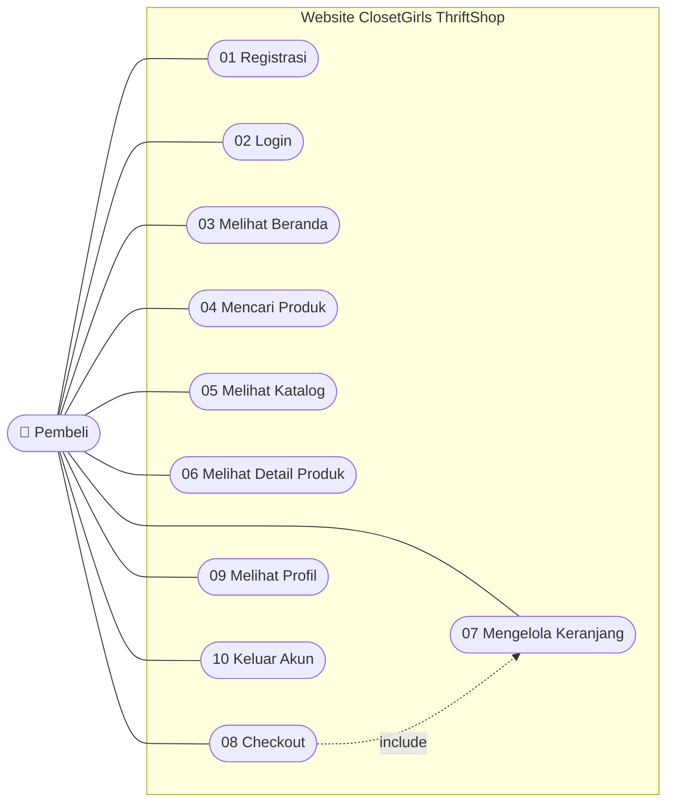
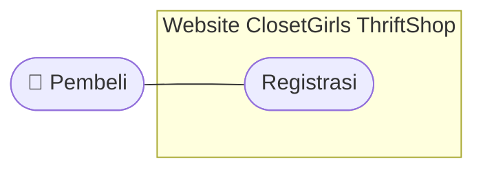
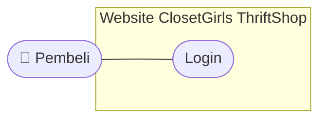
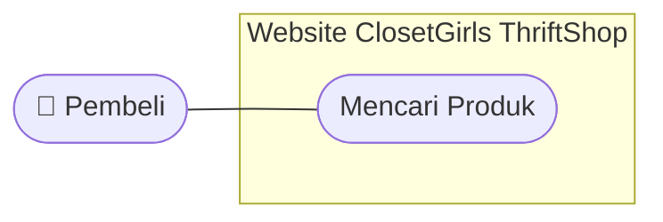
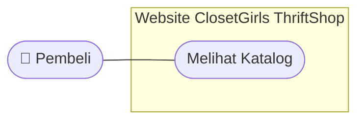
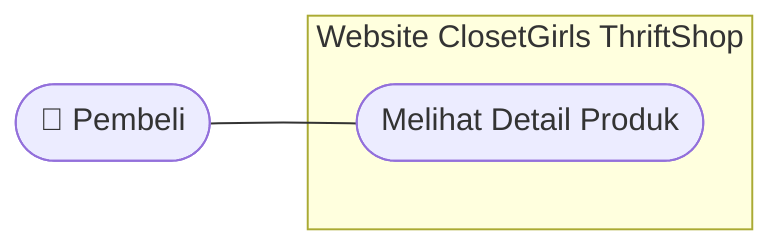
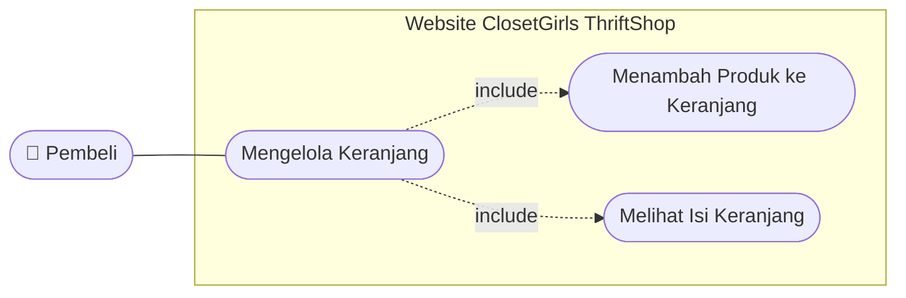
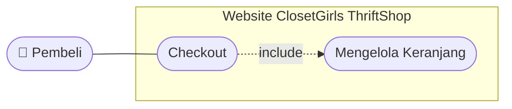
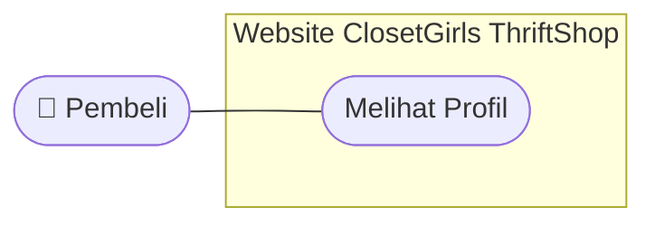
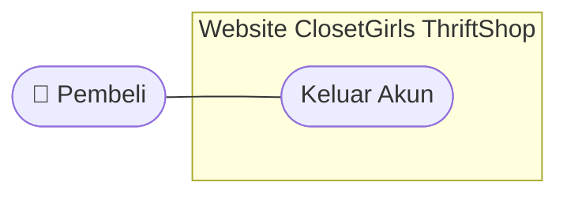

# PENJELASAN USE CASE DIAGRAM
## ClosetGirls ThriftShop

## 1. Pendahuluan

Use Case Diagram merupakan diagram yang digunakan untuk menggambarkan siapa saja yang menggunakan sistem dan fitur apa saja yang dapat mereka lakukan.

Pada proyek ClosetGirls ThriftShop, Use Case Diagram digunakan untuk menjelaskan fitur-fitur utama sistem penjualan pakaian thrift, mulai dari registrasi dan login hingga pengguna keluar dari akun. Fitur yang digambarkan disesuaikan dengan desain Figma dan Sequence Diagram.

## 2. Tujuan Use Case Diagram

Tujuan pembuatan Use Case Diagram pada proyek ClosetGirls ThriftShop adalah:

1. Menggambarkan fitur-fitur yang tersedia pada sistem.
2. Menunjukkan siapa yang menggunakan setiap fitur.
3. Memastikan fitur yang dibuat sesuai dengan desain Figma dan tidak ada fitur tambahan.
4. Mempermudah anggota kelompok memahami cakupan sistem sebelum tahap pengkodean.
5. Menjadi acuan dalam proses pengembangan dan pengujian sistem.

## 3. Aktor

| Aktor | Penjelasan |
|---|---|
| Pembeli | Pengguna website ClosetGirls ThriftShop yang melakukan registrasi, login, melihat dan mencari produk, berbelanja, melihat profil, dan keluar akun. |

Pada desain Figma tidak terdapat halaman admin, sehingga tidak ada aktor Admin. Pada dokumen Sequence Diagram istilah Pengguna dan Pembeli dipakai bergantian. Pada Use Case Diagram ini keduanya disatukan menjadi satu aktor, yaitu **Pembeli**.

## 4. Use Case Diagram Keseluruhan

### Pengertian

Diagram ini menggambarkan seluruh fitur yang dapat dilakukan Pembeli pada website ClosetGirls ThriftShop dalam satu gambar.

### Diagram

### Cara Membaca Diagram

1. **Aktor (Pembeli)** adalah pihak yang menggunakan website.
2. **Kotak "Website ClosetGirls ThriftShop"** adalah batas sistem. Semua use case berada di dalamnya.
3. **Oval** adalah satu fitur yang dapat dilakukan Pembeli.
4. **Garis lurus** berarti Pembeli melakukan fitur tersebut secara langsung.
5. **Panah putus-putus bertuliskan include** berarti fitur tersebut selalu menjalankan fitur lain.

## 5. Daftar Use Case

| No | Use Case | Penjelasan Singkat | Sequence Diagram | Halaman Figma |
|---|---|---|---|---|
| 01 | Registrasi | Membuat akun baru | Registrasi | Registrasi |
| 02 | Login | Masuk ke sistem dengan email dan kata sandi | Login | Login |
| 03 | Melihat Beranda | Melihat kategori dan produk di halaman utama | Beranda | Beranda |
| 04 | Mencari Produk | Mencari produk dengan kata kunci | Pencarian Produk | Search |
| 05 | Melihat Katalog | Melihat daftar produk berdasarkan kategori | Katalog | Katalog |
| 06 | Melihat Detail Produk | Melihat informasi lengkap satu produk | Detail Produk | Detail Produk |
| 07 | Mengelola Keranjang | Menambah produk dan melihat isi keranjang | Keranjang | Keranjang |
| 08 | Checkout | Meninjau dan mengonfirmasi pesanan | Checkout | Checkout |
| 09 | Melihat Profil | Melihat informasi akun | Profil | Profil |
| 10 | Keluar Akun | Mengakhiri sesi dan kembali ke halaman Login | Keluar Akun | Keluar Akun |

## 6. Use Case Registrasi

### Pengertian

Use Case Registrasi menggambarkan fitur ketika calon pengguna membuat akun baru agar dapat menggunakan website ClosetGirls ThriftShop.

### Diagram

### Deskripsi Use Case

| Bagian | Keterangan |
|---|---|
| Aktor | Pembeli |
| Prasyarat | Pembeli belum memiliki akun |
| Halaman Figma | Registrasi |
| Hasil Akhir | Akun baru tersimpan dan Pembeli diarahkan ke halaman Login |

### Alur Utama

1. Pembeli membuka halaman Registrasi.
2. Pembeli mengisi nama, email, nomor telepon, kata sandi, dan konfirmasi kata sandi.
3. Pembeli menekan tombol Daftar.
4. Sistem memvalidasi data dan memeriksa apakah akun sudah terdaftar.
5. Sistem menyimpan akun baru.
6. Sistem menampilkan pesan berhasil dan mengarahkan Pembeli ke halaman Login.

### Alur Alternatif

- Kata sandi tidak sama dengan konfirmasi kata sandi: sistem menampilkan pesan kesalahan.
- Email sudah terdaftar: sistem menampilkan pesan kesalahan dan akun tidak disimpan.
- Ada kolom yang kosong: sistem meminta Pembeli melengkapi data.

## 7. Use Case Login

### Pengertian

Use Case Login menggambarkan fitur ketika Pembeli memasukkan email dan kata sandi untuk masuk ke dalam sistem.

### Diagram

### Deskripsi Use Case

| Bagian | Keterangan |
|---|---|
| Aktor | Pembeli |
| Prasyarat | Pembeli sudah memiliki akun (sudah melakukan Registrasi) |
| Halaman Figma | Login |
| Hasil Akhir | Pembeli masuk ke sistem dan melihat halaman Beranda |

### Alur Utama

1. Pembeli membuka halaman Login.
2. Pembeli memasukkan email dan kata sandi.
3. Pembeli menekan tombol Login.
4. Sistem memeriksa data akun melalui database.
5. Sistem mengarahkan Pembeli ke halaman Beranda.

### Alur Alternatif

- Email atau kata sandi salah: sistem menampilkan pesan kesalahan dan Pembeli tetap di halaman Login.
- Pembeli belum punya akun: Pembeli memilih tautan Daftar untuk menuju halaman Registrasi.

## 8. Use Case Melihat Beranda

### Pengertian

Use Case Melihat Beranda menggambarkan fitur ketika Pembeli membuka halaman utama untuk melihat kategori dan produk yang tersedia.

### Diagram

### Deskripsi Use Case

| Bagian | Keterangan |
|---|---|
| Aktor | Pembeli |
| Prasyarat | Pembeli sudah login |
| Halaman Figma | Beranda |
| Hasil Akhir | Kategori dan produk tampil di halaman Beranda |

### Alur Utama

1. Pembeli berhasil login atau memilih menu Beranda.
2. Sistem mengambil data kategori dan produk dari database.
3. Halaman Beranda menampilkan kategori dan produk.
4. Dari Beranda, Pembeli dapat menuju fitur lain melalui menu di bagian bawah halaman.

### Catatan

Ikon lonceng di Beranda belum memiliki halaman notifikasi, sehingga belum dimasukkan sebagai use case.

## 9. Use Case Mencari Produk

### Pengertian

Use Case Mencari Produk menggambarkan fitur ketika Pembeli mencari produk thrift berdasarkan kata kunci.

### Diagram

### Deskripsi Use Case

| Bagian | Keterangan |
|---|---|
| Aktor | Pembeli |
| Prasyarat | Pembeli sudah login |
| Halaman Figma | Search (kolom pencarian ada di Beranda dan Katalog) |
| Hasil Akhir | Daftar produk yang sesuai kata kunci tampil di halaman Hasil Pencarian |

### Alur Utama

1. Pembeli menekan kolom pencarian.
2. Pembeli mengetik kata kunci, misalnya "Hoodie".
3. Sistem mencari produk yang sesuai melalui database.
4. Halaman Hasil Pencarian menampilkan jumlah dan daftar produk yang ditemukan.

### Alur Alternatif

- Produk tidak ditemukan: sistem menampilkan keterangan bahwa produk tidak tersedia.

## 10. Use Case Melihat Katalog

### Pengertian

Use Case Melihat Katalog menggambarkan fitur ketika Pembeli membuka katalog untuk melihat daftar produk thrift yang tersedia.

### Diagram

### Deskripsi Use Case

| Bagian | Keterangan |
|---|---|
| Aktor | Pembeli |
| Prasyarat | Pembeli sudah login |
| Halaman Figma | Katalog |
| Hasil Akhir | Daftar produk tampil sesuai kategori yang dipilih |

### Alur Utama

1. Pembeli membuka halaman Katalog.
2. Pembeli memilih kategori produk yang diinginkan.
3. Sistem mengambil data produk dari database.
4. Halaman Katalog menampilkan daftar produk.

### Catatan

Ikon filter pada Katalog belum memiliki pilihan filter di desain dan belum ada di Sequence Diagram, sehingga belum dimasukkan sebagai use case.

## 11. Use Case Melihat Detail Produk

### Pengertian

Use Case Melihat Detail Produk menggambarkan fitur ketika Pembeli memilih salah satu produk untuk melihat informasi lengkapnya.

### Diagram

### Deskripsi Use Case

| Bagian | Keterangan |
|---|---|
| Aktor | Pembeli |
| Prasyarat | Pembeli sudah login dan berada di Beranda, Katalog, atau Hasil Pencarian |
| Halaman Figma | Detail Produk |
| Hasil Akhir | Informasi lengkap produk tampil |

### Alur Utama

1. Pembeli memilih salah satu produk.
2. Sistem mengambil data produk dari database.
3. Halaman Detail Produk menampilkan foto, nama, harga, kategori, ukuran, kondisi, deskripsi, dan stok sesuai rancangan Figma.
4. Pembeli dapat menambahkan produk ke keranjang dari halaman ini.

## 12. Use Case Mengelola Keranjang

### Pengertian

Use Case Mengelola Keranjang menggambarkan fitur ketika Pembeli menambahkan produk ke keranjang dan melihat daftar produk yang telah dipilih.

### Diagram

### Deskripsi Use Case

| Bagian | Keterangan |
|---|---|
| Aktor | Pembeli |
| Prasyarat | Pembeli sudah login |
| Halaman Figma | Detail Produk (tombol tambah) dan Keranjang |
| Hasil Akhir | Produk tersimpan di keranjang dan isi keranjang tampil |

### Alur Utama

1. Pembeli menekan tombol tambah ke keranjang di halaman Detail Produk.
2. Sistem memeriksa dan menyimpan data keranjang.
3. Sistem menampilkan konfirmasi penambahan produk.
4. Pembeli membuka halaman Keranjang.
5. Sistem mengambil data keranjang dari database.
6. Halaman Keranjang menampilkan produk beserta total produk.

### Alur Alternatif

- Pembeli mengubah jumlah produk dengan tombol + dan −, atau menghapus produk dengan ikon tempat sampah. Sistem memperbarui keranjang dan menghitung ulang total.

## 13. Use Case Checkout

### Pengertian

Use Case Checkout menggambarkan fitur ketika Pembeli melanjutkan produk di keranjang ke tahap checkout dan mengonfirmasi pesanan.

### Diagram

### Deskripsi Use Case

| Bagian | Keterangan |
|---|---|
| Aktor | Pembeli |
| Prasyarat | Pembeli sudah login dan keranjang berisi produk |
| Halaman Figma | Checkout |
| Hasil Akhir | Pesanan tersimpan dan hasil checkout tampil |

### Alur Utama

1. Pembeli membuka halaman Checkout dari Keranjang.
2. Sistem mengambil data produk dari keranjang.
3. Halaman Checkout menampilkan ringkasan pesanan, alamat pengiriman, dan metode pembayaran (QRIS atau Transfer Bank).
4. Pembeli mengonfirmasi pesanan.
5. Sistem menyimpan data pesanan ke database.
6. Sistem menampilkan hasil checkout.

### Catatan

Di Figma belum ada halaman pembayaran QRIS atau Transfer Bank, sehingga proses bayar belum dimasukkan. Hal ini perlu diputuskan bersama.

## 14. Use Case Melihat Profil

### Pengertian

Use Case Melihat Profil menggambarkan fitur ketika Pembeli membuka halaman Profil untuk melihat informasi akun.

### Diagram

### Deskripsi Use Case

| Bagian | Keterangan |
|---|---|
| Aktor | Pembeli |
| Prasyarat | Pembeli sudah login |
| Halaman Figma | Profil |
| Hasil Akhir | Informasi akun tampil |

### Alur Utama

1. Pembeli membuka halaman Profil.
2. Sistem mengambil data akun dari database.
3. Halaman Profil menampilkan nama, email, status Member, jumlah pesanan, rating, dan favorit.

### Catatan

Menu pada Profil (Informasi Pribadi, Alamat, Metode Pembayaran, Pesanan Saya, Favorit, Bantuan) belum memiliki halaman, sehingga belum dimasukkan sebagai use case.

## 15. Use Case Keluar Akun

### Pengertian

Use Case Keluar Akun menggambarkan fitur ketika Pembeli keluar dari akun ClosetGirls ThriftShop.

### Diagram

### Deskripsi Use Case

| Bagian | Keterangan |
|---|---|
| Aktor | Pembeli |
| Prasyarat | Pembeli sudah login |
| Halaman Figma | Profil dan Keluar Akun |
| Hasil Akhir | Sesi berakhir dan Pembeli kembali ke halaman Login |

### Alur Utama

1. Pembeli membuka halaman Profil.
2. Pembeli memilih menu Keluar Akun.
3. Halaman konfirmasi menampilkan pertanyaan "Yakin ingin keluar?".
4. Pembeli menekan tombol Keluar.
5. Sistem mengakhiri sesi pengguna.
6. Pembeli diarahkan ke halaman Login.

### Alur Alternatif

- Pembeli menekan tombol Batal: Pembeli kembali ke halaman Profil dan sesi tetap aktif.

## 16. Hubungan Antar Use Case

| Hubungan | Penjelasan |
|---|---|
| Checkout *include* Mengelola Keranjang | Checkout selalu memakai produk yang ada di keranjang |
| Mengelola Keranjang *include* Menambah Produk dan Melihat Isi Keranjang | Dua kegiatan yang termasuk dalam satu fitur keranjang |
| Syarat login | Use case 03 sampai 10 hanya dapat dilakukan setelah Login |
| Fitur sebelum login | Registrasi dan Login dapat dibuka tanpa login |

## 17. Hal yang Belum Dimasukkan

Hal berikut ada di Figma tetapi belum jelas atau belum ada di Sequence Diagram, sehingga perlu diputuskan bersama sebelum ditambahkan:

1. Halaman Start yang masih kosong.
2. Filter produk (hanya ada ikon).
3. Notifikasi (ikon lonceng di Beranda).
4. Menu Profil lainnya: Informasi Pribadi, Alamat, Metode Pembayaran, Pesanan Saya, Favorit, Bantuan.
5. Halaman pembayaran QRIS dan Transfer Bank.

## 18. Kesimpulan

Use Case Diagram ClosetGirls ThriftShop memiliki satu aktor, yaitu Pembeli, dan 10 use case: Registrasi, Login, Melihat Beranda, Mencari Produk, Melihat Katalog, Melihat Detail Produk, Mengelola Keranjang, Checkout, Melihat Profil, dan Keluar Akun.

Setiap use case memiliki Sequence Diagram dan halaman Figma yang sesuai. Dengan adanya Use Case Diagram, cakupan sistem lebih mudah dipahami dan dapat menjadi acuan dalam proses pengembangan, pengujian, serta perbaikan sistem ClosetGirls ThriftShop.
